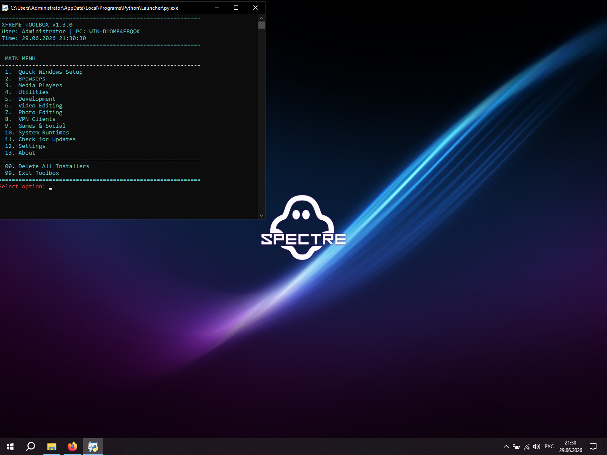

# 🎯 Xfreme Toolbox v1.3.0

👨‍💻 **Author:** XfremeDev  
📧 **Email:** xfremedev@gmail.com  
🌐 **GitHub:** [XfremeDev/Xfreme-Toolbox](https://github.com/XfremeDev/Xfreme-Toolbox)

---

### The Ultimate Windows Optimization Suite

Xfreme Toolbox is a powerful, portable Windows utility that combines 50+ system tweaks, software installers, privacy fixes, and performance optimizations in a single executable. **Now with automatic updates and winget support!**

---

## ✨ Features

### 🚀 New in v1.3.0
- **Winget Integration** - Install software using Windows Package Manager
- **Auto-Update System** - Automatic updates with progress bar
- **Fixed Unicode Encoding** - No more encoding errors
- **Improved Menu Interface** - Clean and organized
- **Installation Statistics** - Track installation progress
- **Better Error Handling** - Clear error messages

### 🔧 System Tweaks
- Disable Action Center, Cortana, Notifications
- Stop Windows Updates
- Clear Event Logs & Update Cache
- Hibernation, Fastboot, Sleep mode control
- Pagefile (Virtual Memory) management
- Compact OS / LZX compression
- Take Ownership context menu
- DNS Flush and Network Reset

### 📦 Software Installers via Winget
**Browsers:**
- Google Chrome, Mozilla Firefox, Brave
- LibreWolf, Vivaldi, Tor Browser, Opera GX

**Media:**
- VLC Media Player, MPC-HC
- Audacity, AIMP, Foobar2000
- K-Lite Codec Pack

**Utilities:**
- 7-Zip, CPU-Z, GPU-Z
- CrystalDiskInfo, HWMonitor
- MSI Afterburner, Rufus, Ventoy

**Development:**
- Visual Studio Code, Git
- Node.js LTS, Docker Desktop
- Python 3.12, Notepad++, SDI

**Video Editing:**
- HandBrake, OBS Studio
- Shotcut, DaVinci Resolve

**Photo Editing:**
- GIMP, ImageGlass

**VPN Clients:**
- ProtonVPN, NordVPN
- ExpressVPN, WireGuard, OpenVPN

**Games & Social:**
- Minecraft Launcher, Roblox
- Discord, TeamSpeak
- Playnite, Steam
- Epic Games Launcher, GOG Galaxy

**System Runtimes:**
- Visual C++ Redistributables AIO
- DirectX Runtime

### 🎮 Gaming Optimizations
- Game Mode toggle
- Ultimate Performance power plan
- Disable Nagle's Algorithm (reduce ping)
- Hardware Accelerated GPU Scheduling
- Game clients installation

### 🎨 Personalization
- Dark/Light mode switch
- Windows 11 context menu restore
- Disable rounded corners
- Sound enhancements
- CMD color schemes
- Custom console colors

### 🌍 Multi-Language Support
- English
- Русский (Russian)

---

## 🚀 Quick Start

### Installation
1. **Download** the latest `XfremeToolbox.exe` from [Releases](https://github.com/XfremeDev/Xfreme-Toolbox/releases)
2. **Run as Administrator** (right-click → Run as Admin)
3. **Select tweaks** from the main menu
4. **Enjoy** a faster Windows!

### Requirements
- Windows Package Manager (winget) - auto-installed with Windows 11, or [download here](https://aka.ms/getwinget)
- Administrative privileges

### First Run
The tool will automatically:
1. Check for updates
2. Verify winget installation
3. Load your language and color preferences
4. Show the main menu

---

## 📸 Screenshots

### Main Menu

---

## 📥 Download

---

## 🛠️ System Requirements

| Requirement | Minimum |
|-------------|---------|
| OS | Windows 10 / 11 (64-bit) |
| RAM | 2 GB |
| Disk Space | 50 MB |
| Admin Rights | Required |

---

## 📄 License

MIT License © 2026 XfremeDev

---

## ⭐ Support

If you find this tool useful, consider giving it a star on GitHub!
